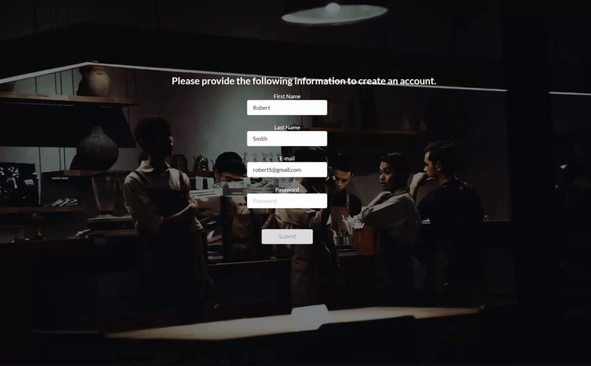

## Blue Saucier

Blue Saucier is an app with the main focus of managing simple yet important tasks in a restaurant kitchen.

### Features

* #### Personal Account

  * Create you own personal account.

  

* #### Ordering Lists
    * Keep track of the different food items needed in the kitchen by creating  ordering lists in an easy and simple way. 

    

    * Lists can be edited for changes or deleted when no longer needed.

    

* #### Menu Planning
  * Plan a menu with different meal courses. 
  
  

  * Set up meal prices and have the option to add a description for each meal.

  

* #### Google Calendar 
  * We know how important it is to keep track of important dates and events so we decided to integrate Google Calendar as part of our app.

* #### Profile Editing
  * Changing your login email, password and other information can be done in the View Profile menu option.

  

### Link:  https://greysaucier.web.app/

## Licence

[MIT](https://choosealicense.com/licenses/mit/)